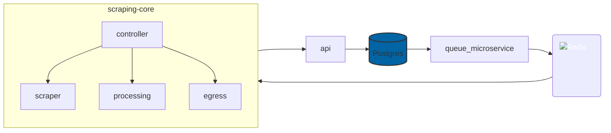
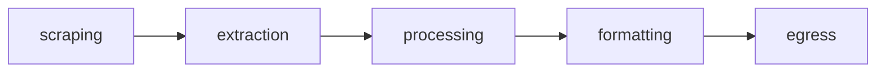

```mermaid
  flowchart LR
    subgraph scraping-core
        direction TB
        top1[controller] --> bottom1[scraper]
        top1[controller] --> bottom2[processing]
        top1[controller] --> bottom3[egress]
    end
    
    postgres --> queue_microservice
    queue_microservice --> redis("<img style='position:absolute;' src='/images/redis.png' /> <div style='position:relative;z-index:100;color:white;padding:15px;padding-bottom: 75px;padding-top:0px;'>Redis</div>");
    redis --> scraping-core
    scraping-core ---> api
    api --> postgres[(Postgres)]
    style postgres fill:#0064a5,stroke:#333,stroke-width:2px
```

```mermaid
  flowchart LR
    scraping --> extraction
    extraction --> processing
    processing --> formatting
    formatting --> egress
```