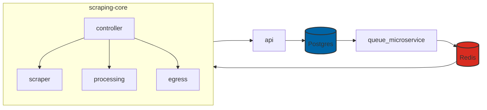
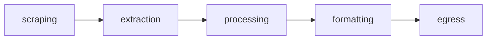

```json
{
    "metadata": {
        "project_id": "279a431e-e94d-48c1-8289-ebc2d3ef56d2"
    },
    "pipeline": {
        "scraping": {
            "url": "https://www.johnlewis.com/browse/electricals/televisions/view-all-tvs/_/N-6srf",
            "fingerprint": {
                "proxy": "",
                "proxy_type": "isp",
                "country_id": "gb",
                "language": "en"
            },
            "instructions": [
                {
                    "action": "wait",
                    "variant": "timeout",
                    "duration": 500
                },
                {
                    "action": "click",
                    "variant": "single",
                    "selector": "[data-test='allow-all']"
                },
                {
                    "action": "extraction",
                    "selector": "[data-test='product-card-price']|text",
                    "output": "price"
                },
                {
                    "action": "extraction",
                    "selector": "[data-test='product-image-container'] a[href]|@href",
                    "output": "url"
                }
            ]
        }
    }
}
```


