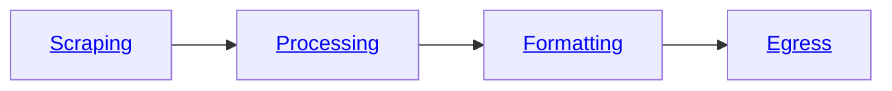

You can use the Bloxed web-scraping platform to **scrape**, **process**, **format** and **egress** web data from a single API or SDK request.

The **pipeline** of your request is segmented into four sections as shown below.



When creating a task you can provide instructions for each of these sections. 
For example, you may want to **scrape** product reviews from Amazon, **process** the reviews with **sentiment analysis**, 
format the **output** into a JSON object and then **egress** the result to an S3 Bucket.

## Getting Started
<Steps>
    <Step title="User Creation" icon="user">
        Sign up to Bloxed from the [Dashboard](https://dashboard.bloxed.com) or with the [signup](api-reference/endpoint/user/signup) route.
    </Step>
    <Step title="Get Your Organization ID" icon="building">
        Fetch your **Organization ID** from the [Dashboard](https://dashboard.bloxed.com) or with the [retrieve](api-reference/endpoint/user/retrieve) route.
    </Step>
    <Step title="Authenticate" icon="lock">
        [Sign in](api-reference/endpoint/user/login) to fetch the bearer token, cookie or API key.
    </Step>
</Steps>

<Note>
Both the **Orgnaization ID** and a method of **Authentication** are required to [create a task](api-reference/endpoint/task/create).
</Note>

## Authentication
Any of the following can be used to authenticate with the API: 
 - [Bearer Token](api-reference/endpoint/user/login)
 - [API key](api-reference/endpoint/api_key)
 - [Session Cookie](api-reference/endpoint/user/login)

The prefered method is using an [API key](api-reference/endpoint/api_key) as shown below.

| Key          | Value                                    |
| ------------ | ---------------------------------------- |
| APIPrivateKey| df1e3fffcafc47f14cdd4779cb39b431a76b4... |
| APIPublicKey | eff79ec00150f7cbaf59cad7e68864fa4d6aa... |

<CodeGroup>

```python scrape.py
import requests

headers = {
    "APIPrivateKey": "df1e3fffcafc47f14cdd4779cb39b431a76b4",
    "APIPublicKey": "eff79ec00150f7cbaf59cad7e68864fa4d6aa"
}

response = requests.get("https://api.bloxed.com/1.0/private/user/1234/task/create", headers=headers)
```

```javascript scrape.js
const axios = require('axios');

const headers = {
    APIPrivateKey: "df1e3fffcafc47f14cdd4779cb39b431a76b4",
    APIPublicKey: "eff79ec00150f7cbaf59cad7e68864fa4d6aa"
};

axios.get("https://api.bloxed.com/1.0/private/user/1234/task/create", { headers })
    .then(response => {
        console.log("Response data:", response.data);
    })
    .catch(error => {
        console.error("Error:", error.response ? error.response.data : error.message);
    });
```

```java scrape.java
public static void main(String[] args) {
    URL url = new URL("https://api.bloxed.com/1.0/private/user/1234/task/create");

    HttpURLConnection connection = (HttpURLConnection) url.openConnection();
    connection.setRequestMethod("GET");
    connection.setRequestProperty("APIPrivateKey", "df1e3fffcafc47f14cdd4779cb39b431a76b4");
    connection.setRequestProperty("APIPublicKey", "eff79ec00150f7cbaf59cad7e68864fa4d6aa");

    try (BufferedReader in = new BufferedReader(new InputStreamReader(connection.getInputStream()))) {
        String inputLine;
        StringBuilder response = new StringBuilder();
        while ((inputLine = in.readLine()) != null) {
            response.append(inputLine);
        }
        System.out.println("Response Body: " + response.toString());
    }
}
```

</CodeGroup>

## Setting up your task

The **scraping** section is where the **url** and **[fingerprint](/pipeline/scraping/fingerprint)** are defined. In addition to this any **[instructions](/pipeline/scraping/instructions)** that are required to navigate the page and **[extract](/pipeline/scraping/instructions#extraction)** the data that you require.
```json
"pipeline": {
    "scraping": {
        "url": "{task url}"
        "fingerprint": {fingerprint object},
        "instructions": [list of instructions]
    }
}
```

### Fingerprint
A [fingerprint](/pipeline/scraping/fingerprint) can be used to alter a variety of parameters when web-scraping.

In this example we want to change the location to Great Britain and to look like a Windows PC.

```json
{
  "proxy_type": "residential",
  "country_id": "gb",
  "operating_system": "windows"
}
```

More options are detailed [here](/pipeline/scraping/fingerprint)

## Extraction
Although Bloxed has many instructions, the simplest form of web-scraping will only require the [extraction](pipeline/scraping/instructions#extraction) instruction.

This allows you to extract information from a webpage by referencing a CSS selector for the element
you need, along with the type of data (**text**, **inner HTML**, or an **attribute value**).

For example if we wanted to extract the text from the css selector '[data-cy='price-recipe'] .a-offscreen'
Our full select is: `"selector": "[data-cy='price-recipe'] .a-offscreen|text"`

Assigning this to the output: `"title"`, the full object is:
```json
{
    "action": "extraction",
    "selector": "[data-cy='price-recipe'] .a-offscreen|text",
    "output": "title"
}
```

#### Selector
In the following example you can see that we are extracting the **text** data from the \
selector `[data-cy='price-recipe'] .a-offscreen`

The format is a pipe seperated string `"css_selector|variant"`

#### Variant

Variants include: **text**, **html**, @[attribute](https://developer.mozilla.org/en-US/docs/Web/HTML/Attributes)

For the HTML: `<h1 id="example" href="https://example.com">Hello World</h1>`

HTML would return the entire element.

TEXT would return: "Hello World"

@href would return: "https://example.com"

#### Output
This is the key where the data will be assigned to in the output.

For Example: `"output": "price"` would return:
```json
{
    "price": [
        "£429.99",
        ...
    ]
}
```
## Advanced
<CardGroup>
<Card title="Ranges" icon="magnifying-glass" href="/pipeline/scraping/instructions#extraction">
  Limit the amount of data extracted to a certain range
</Card>

<Card
  title="Grouped Data"
  icon="layer-group"
  href="/pipeline/instructions#iterate"
>
  Use our iterate instruction to group data from the same parent selector
</Card>
</CardGroup>

Putting this all together we get:
<CodeGroup>
```python scrape.py
import requests

headers = {
    "APIPrivateKey": "df1e3fffcafc47f14cdd4779cb39b431a76b4",
    "APIPublicKey": "eff79ec00150f7cbaf59cad7e68864fa4d6aa"
}

payload = {
    "pipeline": {
        "scraping": {
            "url": "https://www.amazon.co.uk/tv/s?k=tv",
            "fingerprint": {
                "proxy_type": "residential",
                "country_id": "gb"
            },
            "instructions": [
                {
                    "action": "extraction",
                    "selector": "[data-cy='title-recipe']|text",
                    "output": "title"
                }
            ]
        }
    }
}

response = requests.get("https://api.bloxed.com/1.0/private/user/1234/task/create", paylaod=payload, headers=headers)
```

```javascript scrape.js
```

```java scrape.java
```
</CodeGroup>

Here is the output from the Bloxed API:
```json
{
    "title": [
        "Featured from Amazon brands \nAll-new Amazon Fire TV 43\" 4-Series 4K UHD smart TV, stream live TV, 2024 release",
        "Featured from Amazon brands \nPanasonic TX-65MX800B, 65 Inch 4K Ultra HD LED Smart 2023 TV, High Dynamic Range (HDR), Dolby Atmos & Dolby Vision, Fire TV, Prime Video, Alexa, Netflix, Black",
        ...
    ]
}
```

## Processing
### Translation
**What if we wanted to translate the title to another langauge?**

[Processing](pipeline/processing) is a stage of the pipeline where manipulation of the extracted data can take place. This is provided as a list of processing module objects.

For example to translate text we must use the [strip](pipeline/processing/translation#google_translate) variant of the [data_cleaning](pipeline/processing/translation) module.

A full list of supported modules is provided [here](pipeline/processing).

```json
"processing": [
    {
        "module": "translation",
        "variant": "google_translate",
        "from": "en",
        "to": "fr",
        "input": "title"
    }
]
```

The following output is produced:
```json
{
    "title": [
        "En vedette des marques Amazon Tout nouveau téléviseur intelligent Amazon Fire TV 43 4-Series 4K UHD, diffusion en direct de la télévision, sortie en 2024",
        "En vedette des marques Amazon Panasonic TX-65MX800B, Téléviseur intelligent LED 4K Ultra HD 65 pouces 2023, High Dynamic Range (HDR), Dolby Atmos et Dolby Vision, Fire TV, Prime Video, Alexa, Netflix, Noir",
        ...
    ]
}
```

As you can see it is very simple to scrape, process and egress from a seemingly complicated website. 

<CodeGroup>
```python scrape.py
import requests

headers = {
    "APIPrivateKey": "df1e3fffcafc47f14cdd4779cb39b431a76b4",
    "APIPublicKey": "eff79ec00150f7cbaf59cad7e68864fa4d6aa"
}

payload = {
    "pipeline": {
        "scraping": {
            "url": "https://www.amazon.co.uk/tv/s?k=tv",
            "fingerprint": {
                "proxy_type": "residential",
                "country_id": "gb"
            },
            "instructions": [
                {
                    "action": "extraction",
                    "selector": "[data-cy='title-recipe']|text",
                    "output": "title"
                }
            ]
        },
        "processing": [
            {
                "module": "translation",
                "variant": "google_translate",
                "from": "en",
                "to": "fr"
                "input": "title"
            }
        ]
    }
}

response = requests.get("https://api.bloxed.com/1.0/private/user/1234/task/create", paylaod=payload, headers=headers)
```

```javascript scrape.js
```

```java scrape.java
```
</CodeGroup>

<CardGroup>
<Card title="Add a custom fingerprint" icon="fingerprint" href="/pipeline/scraping/fingerprint">
  Add a custom browser fingerprint to suite your needs.
</Card>

<Card
  title="Add data processing"
  icon="list"
  href="/pipeline/processing/overview"
>
  Implement a data processing pipeline to clean the data exactly how you want.
</Card>

<Card
  title="Format your data"
  icon="file-csv"
  href="/pipeline/formatting"
>
  Set a formatting stage to manipulate the data to suite any output.
</Card>

<Card
  title="Egress to your favourite platform"
  icon="upload"
  href="/pipeline/egress/overview"
>
  Send your finished scrape to a variety of external platforms.
</Card>
</CardGroup>
