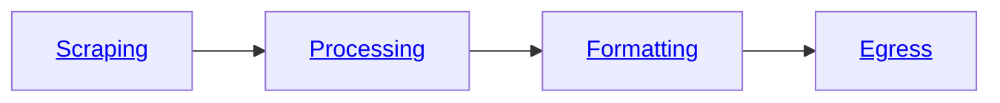

The Bloxed Web Scraping Platform is segmented into four sections of our **[pipeline](/pipeline)** as shown below.



The **Scraping** section is where the **url** and **[fingerprint](/metadata/fingerprint)** are defined. In addition to this any **[instructions](/pipeline/scraping/instructions)** that are required to navigate the page and **[extract](/pipeline/scraping/instructions#extraction)** the data that you require.

The simplest form of web-scraping will only require the extraction instructions.

These objects require **selector** and **output** fields.

In this example you can see that we are extracting the **text** data from the \
selector `[data-cy='price-recipe'] .a-offscreen`


The format is a pipe seperated string `"css_selector|variant"`

Variants include: **text**, **html**, @[attribute](https://developer.mozilla.org/en-US/docs/Web/HTML/Attributes)

## Setting up your task

Learn how to create a task pipeline to scrape a site
```json
{
    "pipeline": {
        "scraping": {
            "url": "https://www.amazon.co.uk/tv/s?k=tv",
            "fingerprint": {
                "proxy_type": "residential",
                "country_id": "gb"
            },
            "instructions": [
                {
                    "action": "extraction",
                    "selector": "[data-cy='price-recipe'] .a-offscreen|text",
                    "output": "price"
                }
            ]
        }
    }
}
```

Here is the output:
```json
{
    "price": [
        "£429.99",
        "£679.00",
        "£699.99",
        "£189.00",
        "£239.00",
        "£159.00",
        ...
    ]
}
```

### What if we want to limit the number of elements scraped?
**Range** can be provided either shorthand as colon seperated `"range": "0:5"` \
or as a range object as shown below.
```json
"range": {
  "start": 0,
  "end": 5
}
```

Our task object now looks like this:
```json
{
    "pipeline": {
        "scraping": {
            "url": "https://www.amazon.co.uk/tv/s?k=tv",
            "fingerprint": {
                "proxy_type": "residential",
                "country_id": "gb"
            },
            "instructions": [
                {
                    "action": "extraction",
                    "selector": "[data-cy='price-recipe'] .a-offscreen|text",
                    "output": "price",
                    "range": "0:5"
                }
            ]
        }
    }
}
```

Our output now looks like this:
```json
{
    "price": [
        "£429.99",
        "£679.00",
        "£699.99",
        "£189.00",
        "£239.00"
    ]
}
```

### What if you want the **title** and **price** from each product?
We need to use the [iterate](pipeline/scraping/instructions#iterate) instruction.

```json
{
    "action": "iterate",
    "parent_selector": ".s-card-container",
    "group_output": "product",
    "range": "0:5",
    "instructions": [
        {
            "action": "extraction",
            "selector": "[data-cy='title-recipe']|text",
            "output": "title"
        },
        {
            "action": "extraction",
            "selector": "[data-cy='price-recipe'] .a-offscreen|text",
            "output": "price"
        }
    ]
}
```

As you can see in the iterate instruction, we require the parent selector of the group. In the example we have used `.s-card-container` which is the selector for each product.

We have also chosen a **group output** name which is the key for our product output.

Additionaly, exactly the same as before, we have specified the **range** of products that we would like to extract.

This is our new output:
```json
{
    "product": [
        {
            "price": [
                "£429.99"
            ],
            "title": [
                "Featured from Amazon brands \nAll-new Amazon Fire TV 43\" 4-Series 4K UHD smart TV, stream live TV, 2024 release"
            ]
        },
        {
            "price": [
                "£679.00"
            ],
            "title": [
                "Featured from Amazon brands \nPanasonic TX-65MX800B, 65 Inch 4K Ultra HD LED Smart 2023 TV, High Dynamic Range (HDR), Dolby Atmos & Dolby Vision, Fire TV, Prime Video, Alexa, Netflix, Black"
            ]
        },
        {
            "price": [
                "£189.00"
            ],
            "title": [
                "TCL 40SF540K 40-inch FHD Smart Television - HDR & HLG-Dolby Audio-DTS Virtual X/DTS-HD-Metal Bezel-less-Dual-band Wifi 5-with Fire OS 7 system"
            ]
        },
        {
            "price": [
                "£279.98"
            ],
            "title": [
                "Hisense 40 Inch Smart TV 40A4NTUK - FHD Resolution, Natural Colour Enhancer, DTS Virtual:X & Dolby Audio, AI Sports Mode, VIDAA OS with Youtube, Netflix and Disney+ and Freeview Play (2024 Model)"
            ]
        },
        {
            "price": [
                "£199.00"
            ],
            "title": [
                "Hisense 40 Inch Smart TV 40E4NTUK - FHD Resolution, Natural Colour Enhancer, DTS Virtual:X & Dolby Audio, AI Sports Mode, VIDAA OS with Youtube, Netflix and Disney+ and Freeview Play (2024 Model)"
            ]
        }
    ]
}
```

### What if we wanted to remove certain characters?

[Processing](pipeline/processing) is a stage of the pipeline where manipulation of the extracted data can take place. This is provided as a list of processing module objects.

For example to **remove** characters we must use the [replace](pipeline/processing/data_cleaning#replace) variant of the [data_cleaning](pipeline/processing/data_cleaning) module.

Below we are:
- Replacing "," and "£" characters with an empty string "" for every element in the price array within each product.
- Replacing newline "\n" characters with an empty string "" for every element in the title array within each product.

```json
"processing": [
  {
      "module": "data_cleaning",
      "variant": "replace",
      "old": ",",
      "new": "",
      "input": "product.[].price.[]"
  },
  {
      "module": "data_cleaning",
      "variant": "replace",
      "old": "£",
      "new": "",
      "input": "product.[].price.[]"
  },
  {
      "module": "data_cleaning",
      "variant": "replace",
      "old": "\n",
      "new": "",
      "input": "product.[].title.[]"
  }
]
```


<CardGroup>
<Card title="Add a custom fingerprint" icon="fingerprint" href="/metadata/fingerprint">
  Add a custom browser fingerprint to suite your needs.
</Card>

<Card
  title="Add data processing"
  icon="list"
  href="/pipeline/processing/overview"
>
  Implement a data processing pipeline to clean the data exactly how you want.
</Card>

<Card
  title="Format your data"
  icon="file-csv"
  href="/pipeline/formatting"
>
  Set a formatting stage to manipulate the data to suite any output.
</Card>

<Card
  title="Egress to your favourite platform"
  icon="upload"
  href="/pipeline/egress/overview"
>
  Send your finished scrape to a variety of external platforms.
</Card>
</CardGroup>
