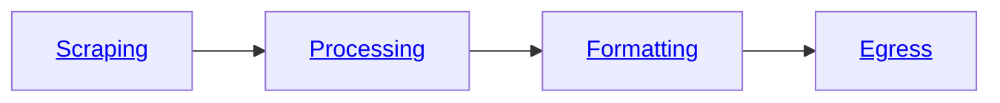

The Bloxed Web Scraping Platform is segmented into four sections of our **[pipeline](/pipeline)** as shown below.



The **Scraping** section is where the **url** and **[fingerprint](/metadata/fingerprint)** are defined. In addition to this any **[instructions](/pipeline/scraping/instructions)** that are required to navigate the page and **[extract](/pipeline/scraping/instructions#extraction)** the data that you require.

The simplest form of web-scraping will only require the extraction instructions.

These objects require **selector** and **output** fields.

In this example you can see that we are extracting the **text** data from the \
selector `[data-cy='price-recipe'] .a-offscreen`


The format is a pipe seperated string `"css_selector|variant"`

Variants include: **text**, **html**, @[attribute](https://developer.mozilla.org/en-US/docs/Web/HTML/Attributes)


## Setup your task

Learn how to create a task pipeline to scrape a site
```json
{
    "pipeline": {
        "scraping": {
            "url": "https://www.amazon.co.uk/tv/s?k=tv",
            "fingerprint": {
                "proxy_type": "residential",
                "country_id": "gb"
            },
            "instructions": [
                {
                    "action": "extraction",
                    "selector": "[data-cy='price-recipe'] .a-offscreen|text",
                    "output": "price"
                }
            ]
        }
    }
}
```

<CardGroup>

<Card title="Add a custom fingerprint" icon="fingerprint" href="/metadata/fingerprint">
  Add a custom browser fingerprint to suite your needs.
</Card>

<Card
  title="Add data processing"
  icon="list"
  href="/pipeline/processing/overview"
>
  Implement a data processing pipeline to clean the data exactly how you want.
</Card>

<Card
  title="Format your data"
  icon="file-csv"
  href="/pipeline/formatting"
>
  Set a formatting stage to manipulate the data to suite any output.
</Card>

<Card
  title="Egress to your favourite platform"
  icon="upload"
  href="/pipeline/egress/overview"
>
  Send your finished scrape to a variety of external platforms.
</Card>

</CardGroup>
