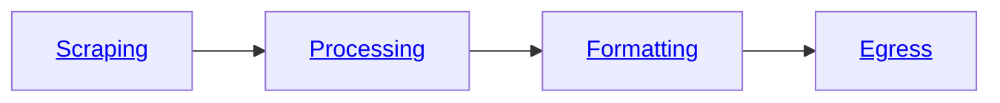

The Bloxed Web Scraping Platform is segmented into four sections of our **[pipeline](/pipeline)** as shown below.



## Scraping
<Steps>
    <Step title="User Creation">
        Create a user with the [signup](api-reference/endpoint/user/signup) route.
    </Step>
    <Step title="Get Your Organization ID">
        Use the [retrieve](api-reference/endpoint/user/retrieve) route to fetch your **Organization ID**.
    </Step>
    <Step title="Authenticate">
        [Sign in](api-reference/endpoint/user/login) to fetch the bearer token, cookie or api key.
    </Step>
</Steps>

<Note>
Both the **orgnaization ID** and **api bearer token** will be required to [create a task](api-reference/endpoint/task/create).
</Note>

**Authorization**: Any of the following: [[Bearer Token](api-reference/endpoint/user/login), [API key](api-reference/endpoint/api_key), [Session Cookie](api-reference/endpoint/user/login)] can be used to authenticate with the API.

### Setting up your task

The **scraping** section is where the **url** and **[fingerprint](/pipeline/scraping/fingerprint)** are defined. In addition to this any **[instructions](/pipeline/scraping/instructions)** that are required to navigate the page and **[extract](/pipeline/scraping/instructions#extraction)** the data that you require.
```json
"pipeline": {
    "scraping": {
        "url": "{task url}"
        "fingerprint": {fingerprint object},
        "instructions": [list of instructions]
    }
}
```

#### Fingerprint
[Fingerprinting](/pipeline/scraping/fingerprint) can be used to alter a variety of parameters when scraping.
For this example we would just like to generate a residential proxy based in Great Britain. Here is how we would do this:
```json
{
  "proxy_type": "residential",
  "country_id": "gb"
}
```

### Extraction
Although Bloxed has many instructions, the simplest form of web-scraping will only require the [extraction](pipeline/scraping/instructions#extraction) instruction.

These objects require a **selector**, **variant** and **output**.

#### Selector
In the following example you can see that we are extracting the **text** data from the \
selector `[data-cy='price-recipe'] .a-offscreen`

The format is a pipe seperated string `"css_selector|variant"`

Giving us the full selector: `"selector": "[data-cy='price-recipe'] .a-offscreen|text"`

#### Variant

Variants include: **text**, **html**, @[attribute](https://developer.mozilla.org/en-US/docs/Web/HTML/Attributes)

For the HTML: `<h1 id="example" href="https://example.com">Hello World</h1>`

HTML would return the entire element.

TEXT would return: "Hello World"

@href would return: "https://example.com"

#### Output
This is the key where the data will be assigned, once output.
For Example: `"output": "price"` would return:
```json
{
    "price": [
        "£429.99",
        ...
    ]
}
```


Putting this all together we get:
```json
{
    "pipeline": {
        "scraping": {
            "url": "https://www.amazon.co.uk/tv/s?k=tv",
            "fingerprint": {
                "proxy_type": "residential",
                "country_id": "gb"
            },
            "instructions": [
                {
                    "action": "extraction",
                    "selector": "[data-cy='price-recipe'] .a-offscreen|text",
                    "output": "price"
                }
            ]
        }
    }
}
```

Here is the output from the Bloxed API:
```json
{
    "price": [
        "£429.99",
        "£679.00",
        "£699.99",
        "£189.00",
        "£239.00",
        "£159.00",
        ...
    ]
}
```
### Ranges
**What if we want to limit the number of elements scraped?**

**Range** can be provided shorthand as colon seperated `"range": "0:5"` \
or longhand as a range object as shown below.
```json
"range": {
  "start": 0,
  "end": 5
}
```

Our task object now looks like this:
```json
{
    "pipeline": {
        "scraping": {
            "url": "https://www.amazon.co.uk/tv/s?k=tv",
            "fingerprint": {
                "proxy_type": "residential",
                "country_id": "gb"
            },
            "instructions": [
                {
                    "action": "extraction",
                    "selector": "[data-cy='price-recipe'] .a-offscreen|text",
                    "output": "price",
                    "range": "0:5"
                }
            ]
        }
    }
}
```

Our output now looks like this:
```json
{
    "price": [
        "£429.99",
        "£679.00",
        "£699.99",
        "£189.00",
        "£239.00"
    ]
}
```
### Iterate
**What if you want the **title** and **price** from each product?**

We need to use the [iterate](pipeline/scraping/instructions#iterate) instruction.
This instruction will execute a list of sub-instructions (extraction rules) that exists under the parent selector provided.

```json
{
    "action": "iterate",
    "parent_selector": ".s-card-container",
    "group_output": "product",
    "range": "0:5",
    "instructions": [
        {
            "action": "extraction",
            "selector": "[data-cy='title-recipe']|text",
            "output": "title"
        },
        {
            "action": "extraction",
            "selector": "[data-cy='price-recipe'] .a-offscreen|text",
            "output": "price"
        }
    ]
}
```

As you can see in the iterate instruction, we require the parent selector of the group. In the example we have used `.s-card-container` which is the selector for each product.

We have also chosen a **group output** name which is the key for our product output.

Additionaly, exactly the same as before, we have specified the **range** of products that we would like to extract.

This is our new output:
```json
{
    "product": [
        {
            "price": [
                "£429.99"
            ],
            "title": [
                "Featured from Amazon brands \nAll-new Amazon Fire TV 43\" 4-Series 4K UHD smart TV, stream live TV, 2024 release"
            ]
        },
        {
            "price": [
                "£679.00"
            ],
            "title": [
                "Featured from Amazon brands \nPanasonic TX-65MX800B, 65 Inch 4K Ultra HD LED Smart 2023 TV, High Dynamic Range (HDR), Dolby Atmos & Dolby Vision, Fire TV, Prime Video, Alexa, Netflix, Black"
            ]
        },
        ...
    ]
}
```
## Processing
### Data Cleaning
**What if we wanted to remove certain characters?**

[Processing](pipeline/processing) is a stage of the pipeline where manipulation of the extracted data can take place. This is provided as a list of processing module objects.

For example to **remove** characters we must use the [strip](pipeline/processing/data_cleaning#strip) variant of the [data_cleaning](pipeline/processing/data_cleaning) module.

A full list of supported modules is provided [here](pipeline/processing).

In the example below we are:
- Stripping "," and "£" characters from every element in the price array within each product.
- Stripping newline "\n" characters from every element in the title array within each product.

```json
"processing": [
    {
        "module": "data_cleaning",
        "variant": "strip",
        "character": ",",
        "input": "product.[].price.[]"
    },
    {
        "module": "data_cleaning",
        "variant": "strip",
        "character": "£",
        "input": "product.[].price.[]"
    },
    {
        "module": "data_cleaning",
        "variant": "strip",
        "character": "\n",
        "input": "product.[].title.[]"
    }
]
```

The following output is produced:
```json
{
    "product": [
        {
            "price": [
                "429.99"
            ],
            "title": [
                "Featured from Amazon brands All-new Amazon Fire TV 43\" 4-Series 4K UHD smart TV, stream live TV, 2024 release"
            ]
        },
        {
            "price": [
                "679.00"
            ],
            "title": [
                "Featured from Amazon brands Panasonic TX-65MX800B, 65 Inch 4K Ultra HD LED Smart 2023 TV, High Dynamic Range (HDR), Dolby Atmos & Dolby Vision, Fire TV, Prime Video, Alexa, Netflix, Black"
            ]
        },
        ...
    ]
}
```

## Egress
### Webhook
The simplest way to retrieve the output from your scrape (other than as a response from our API). Is to use the [webhook module](pipeline/egress/webhook) module.

First go to https://webhook.site and get the webhook URL that is generated. (or use your own!)

Next we can add an egress stage to our pipeline.
```json
"egress": [
  {
    "module": "webhook",
    "url": "{insert webhook url here}",
    "headers": {}
  }
]
```

Now any task submitted with the egress module will be sent to that webhook endpoint instead of as a response to the API request.

Finally, here is our entire web-scraping pipeline request.

As you can see it is very simple to scrape, process and egress from a seemingly complicated website. 

```json
{
    "pipeline": {
        "scraping": {
            "url": "https://www.amazon.co.uk/tv/s?k=tv",
            "fingerprint": {
                "proxy_type": "residential",
                "country_id": "gb"
            },
            "instructions": [
                {
                    "action": "iterate",
                    "parent_selector": ".s-card-container",
                    "group_output": "product",
                    "range": "0:5",
                    "instructions": [
                        {
                            "action": "extraction",
                            "selector": "[data-cy='title-recipe']|text",
                            "output": "title"
                        },
                        {
                            "action": "extraction",
                            "selector": "[data-cy='price-recipe'] .a-offscreen|text",
                            "output": "price"
                        }
                    ]
                }
            ]
        },
        "processing": [
            {
                "module": "data_cleaning",
                "variant": "strip",
                "character": ",",
                "input": "product.[].price.[]"
            },
            {
                "module": "data_cleaning",
                "variant": "strip",
                "character": "£",
                "input": "product.[].price.[]"
            },
            {
                "module": "data_cleaning",
                "variant": "strip",
                "character": "\n",
                "input": "product.[].title.[]"
            }
        ],
      "egress": [
        {
          "module": "webhook",
          "url": "{insert webhook url here}",
          "headers": {}
        }
      ]
    }
}
```

<CardGroup>
<Card title="Add a custom fingerprint" icon="fingerprint" href="/pipeline/scraping/fingerprint">
  Add a custom browser fingerprint to suite your needs.
</Card>

<Card
  title="Add data processing"
  icon="list"
  href="/pipeline/processing/overview"
>
  Implement a data processing pipeline to clean the data exactly how you want.
</Card>

<Card
  title="Format your data"
  icon="file-csv"
  href="/pipeline/formatting"
>
  Set a formatting stage to manipulate the data to suite any output.
</Card>

<Card
  title="Egress to your favourite platform"
  icon="upload"
  href="/pipeline/egress/overview"
>
  Send your finished scrape to a variety of external platforms.
</Card>
</CardGroup>
